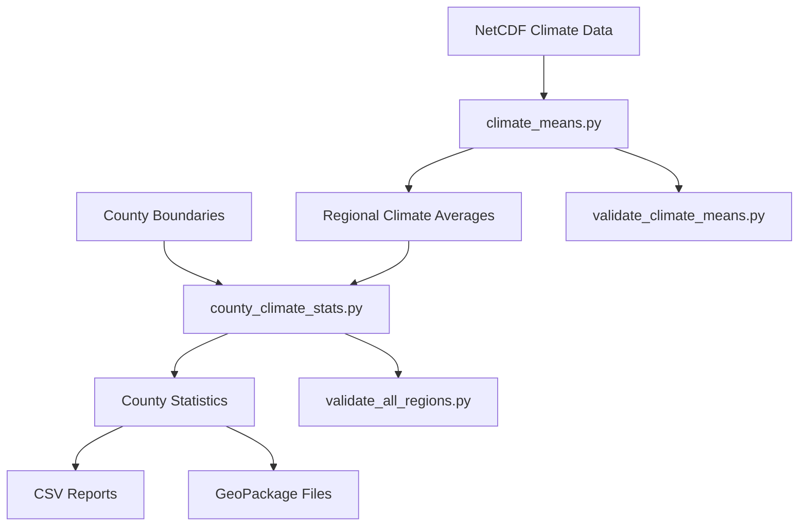

# County Climate Analysis

A Python-based toolkit for analyzing climate data at the county level across U.S. territories. This project processes daily temperature and precipitation data to calculate climate statistics and visualize trends at the county level.

## Features

- Processes daily climate data (temperature and precipitation) from NetCDF files
- Calculates county-level climate statistics including:
  - Annual mean temperature
  - Days above 90°F (32.22°C)
  - Days below 32°F (0°C)
  - Total annual precipitation
  - Days with precipitation > 1 inch (25.4mm)
- Supports multiple U.S. regions:
  - Contiguous United States (CONUS)
  - Alaska (AK)
  - Hawaii and Islands (HI)
  - Puerto Rico and U.S. Virgin Islands (PRVI)
  - Guam and Northern Mariana Islands (GU)
- Handles multiple climate scenarios (historical and SSP projections)
- Parallel processing support using Dask for efficient computation

## Workflow



## Setup

1. Clone the repository:
```bash
git clone https://github.com/mihiarc/countyclim.git
cd countyclim
```

2. Create and activate a virtual environment:
```bash
python -m venv .venv
source .venv/bin/activate  # On Windows: .venv\Scripts\activate
```

3. Install dependencies using uv:
```bash
pip install uv
uv pip install -r requirements.txt
```

## Data Structure

- `/data/`
  - `/hurs/` - Relative humidity data
  - `/pr/` - Precipitation data
  - `/tas/` - Average temperature data
  - `/tasmax/` - Maximum temperature data
  - `/tasmin/` - Minimum temperature data
  - `/tl_2024_us_county/` - County boundary data

- `/output/`
  - `/climate_means/` - Processed regional climate averages
  - `/county_boundaries/` - Processed county boundary files
  - `/county_climate_stats/` - County-level climate statistics
  - `/figures/` - Output visualizations

## Usage

1. Process climate means for all regions:
```bash
python climate_means.py
```

2. Calculate county-level climate statistics:
```bash
python county_climate_stats.py
```

3. Validate results:
```bash
python validate_climate_means.py
python validate_all_regions.py
```

## Technical Details

- Uses Dask for distributed computing with configurable workers and memory limits
- Supports chunked processing of large NetCDF files
- Implements efficient zonal statistics calculation
- Handles coordinate system conversions (0-360° to -180-180°)
- Includes comprehensive data validation and error handling
- Generates both spatial (GeoPackage) and tabular (CSV) outputs

## Output Files

- `county_climate_stats.csv`: Tabular data with climate statistics for each county
- `county_climate_stats.gpkg`: Spatial data with county geometries and climate statistics
- Daily statistics stored in parquet format for each climate variable
- Validation reports and figures in the output directory

## Dependencies

Key dependencies include:
- xarray for NetCDF data processing
- geopandas for spatial data handling
- dask for parallel processing
- rasterstats for zonal statistics
- cartopy for map projections
- regionmask for region definitions

## Notes

- Large data files in `/data/` and processed outputs in `/output/` are not tracked in git
- Processing requires significant memory (recommended: 64GB+)
- Parallel processing is configurable through environment variables 